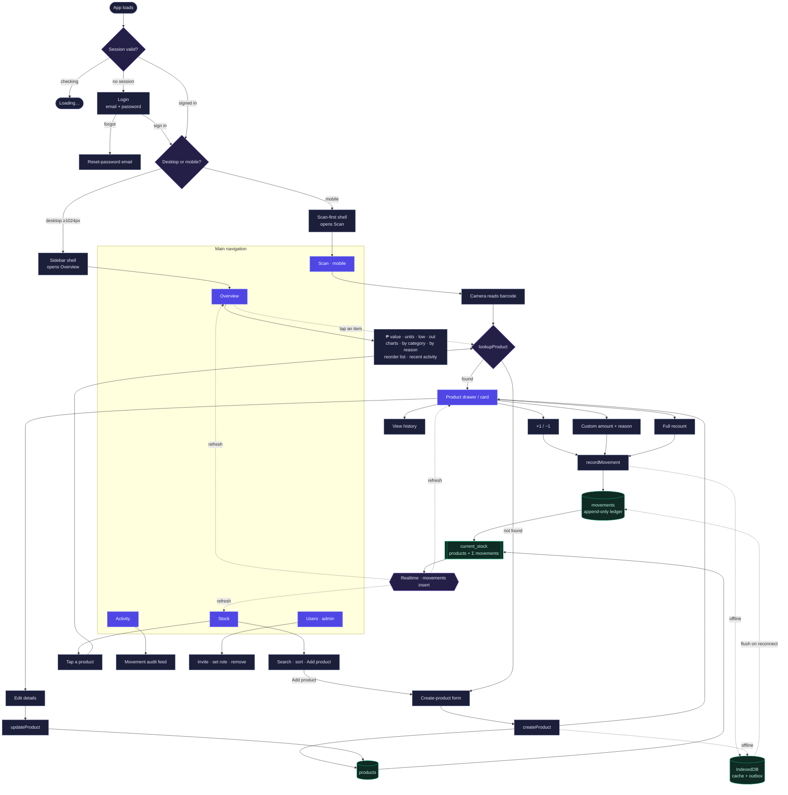

# Inventory Tracker — Application Flow

How a session moves from sign-in through the screens and into the append-only
stock loop. `movements` is the only writable ledger; `current_stock` is a
computed view (`products` + Σ `movements`), so quantities are never overwritten.

**Legend** — indigo = screen · navy = action/function · emerald = data store ·
violet = decision / event · dashed edge = offline queue or realtime refresh.

## Key invariants

- **Stock is append-only.** Every change is a signed row in `movements`
  (`received`, `sold`, `damaged`, `returned`, `count_adjustment`, `transfer`).
  There is no UPDATE/DELETE policy on the table — the ledger is permanent.
- **`current_stock` is computed**, never stored: `qty = Σ movements.delta`, and
  `needs_reorder = qty ≤ reorder_point`.
- **Products carry metadata only** (name, category, unit, reorder point, cost,
  price in ₱) — never a quantity. Created via the form, edited in the drawer.
- **Offline-first writes**: when the network is down, movements and creates queue
  in an IndexedDB outbox and flush automatically on reconnect.
- **Realtime**: a `movements` INSERT subscription refreshes every open view
  within ~1s, so all devices stay in sync.
